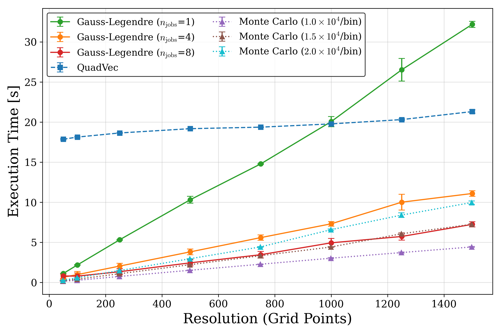

Benchmarking
============

This section presents benchmarks for the performance of DebrisPy’s azimuthally averaged surface density (ASD) computation methods under realistic physical conditions.

Benchmark Setup
---------------

To ensure the benchmarks reflect realistic usage (i.e. in a research context), we test the pipeline on a physically motivated setup: a debris disc undergoing secular evolution under the influence of an interior planetary companion. 
This system has sharp features that develop in the surface density profile, especially when the free and forced eccentricities are comparable, hence being a good benchmark for the DebrisPy pipeline.

The semi-major axis range is set as ``a_min = 3.0``, ``a_max = 20.0``, and the surface density in semi-major axis is given by:

.. math::

   \Sigma_a(a) = \Sigma_0 \left( \frac{a_\text{in}}{a} \right)^p \cdot \frac{1}{2} \left[ 1 + \tanh\left( \frac{a - a_\text{in}}{w_\text{in}} \right) \right]
   \cdot \frac{1}{2} \left[ 1 + \tanh\left( \frac{a_\text{out} - a}{w_\text{out}} \right) \right]

where we choose :math:`\Sigma_0 = 1.0`, :math:`p = 1.0`, :math:`a_\text{in} = 4.0`, :math:`a_\text{out} = 15.0`, :math:`w_\text{in} = 0.2`, and :math:`w_\text{out} = 0.2`.

This is implemented in DebrisPy as:

.. code-block:: python

    def sig_a_smooth(a, *pars):
        plaw = pars[0] 
        sigma0 = pars[1] 
        a_in = pars[2] 
        a_out  = pars[3] 
        w_in = pars[4] 
        w_out = pars[5] 
            
        f_1 = sigma0*(a_in/a)**plaw
        f_2 = 0.5*(1.0+np.tanh((a-a_in)/w_in))
        f_3 = 0.5*(1.0+np.tanh((a_out-a)/w_out))

        return f_1*f_2*f_3

    sigma_a = SigmaA(
        a_min=3,
        a_max=20,
        profile_type="custom",
        sigma_func=lambda a: sig_a_smooth(a, 1.0, 1.0, 4.0, 15.0, 0.2, 0.2)
    )

The eccentricity profile is given by the secular solution with :math:`f` being the free/forced eccentricity ratio:

.. math::

   e(t) =  e_\text{forced} \sqrt{1 + f^2 - 2f \cos(At)}

where the forced eccentricity is defined as

.. math::

   e_\text{forced} = e_p \left| \frac{B_p}{A_p} \right|

with :math:`e_p` being the eccentricity of the perturbing planet. In this benchmark, we set :math:`f = 1`, :math:`e_p = 0.4`, and use

.. math::

   A_p = a^{-3.5}, \quad B_p = 1.25 \cdot a^{-4.5}

The time is evaluated at :math:`t = 5 t_\text{sec}`, where the secular timescale is defined as :math:`t_\text{sec} = 2\pi a^{3.5}` for :math:`a = 4.0`.

This is implemented in DebrisPy as:

.. code-block:: python

    a_min = 3.0
    a_max = 20.0

    def full_ecc(a, e_p, free_fr, t):
        a = np.asarray(a, dtype=float)

        # Precompute A_p and B_p
        A = a**(-3.5)
        B = 1.25 * a**(-4.5)

        # apply in‐range mask
        in_range = (a > a_min) & (a < a_max)

        # safe division with cap at 1e6
        numer = e_p * B
        denom = np.abs(A)  # since dotvarpi == 0
        f_ecc = np.where(numer < 1e6 * denom, numer / denom, 1e6)

        # compute the oscillatory factor
        oscill = np.sqrt(1 + free_fr**2 - 2 * free_fr * np.cos(A * t))
        f_val = f_ecc * oscill

        # set to zero outside [a_min, a_max]
        f_val = np.where(in_range, f_val, 0.0)

        # clip maximum to 0.99
        return np.minimum(f_val, 0.99)
    
    ecc_profile = UniqueEccentricity(a_min=3, a_max=20, eccentricity_func = lambda a: full_ecc(a, 0.4, 1.0, 5 * t_sec))

    # We only compute the kernel for the range of r in [3, 10]
    kernel = Kernel(ecc_profile, r_min=3, r_max=10)
    kernel.compute()

Benchmark Comparisons
---------------------

.. important::

   All timings are computed on a 2021 MacBook Pro with an M1 Pro processor.

   To provide a rough sense of baseline performance, the time to generate 1 million uniform random numbers over 500 runs is :math:`0.005 \pm 0.004` seconds.

We perform two benchmarking experiments:

1. **Single-point evaluation**: Comparing how long it takes to compute $\bar\Sigma(r)$ for a single value of `r`.
2. **Full ASD grid timing**: Measuring total compute time for a range of `r` values using:
   - The quadvec method (vectorised but non-parallelised)
   - The Gauss-Legendre method with 1, 4, and 8 jobs (parallelised)
   - Monte Carlo sampling, with samples scaled to match semi-analytic resolution

To compare with Monte Carlo, we need to link the number of samples to the grid size in main pipeline. 
We determine the bin width math:`\Delta r` from the grid size and scale the number of required Monte Carlo samples such that :math:`n_{samples} = n_{bins} * \text{multiplier}`.

We explore 3 different multipliers: 10,000, 15,000, and 20,000. An example of how the number of samples is scaled is given below for 15,000 particles per bin.

.. code-block:: python

    # Determine the bin width and number of bins
    delta_r = (r_max - r_min) / r_size
    n_bins = int((r_max - r_min) / delta_r)

    # Number of samples is scaled to match the semi-analytic resolution (15,000 particles per bin)
    n_samples = n_bins * 15000

Single-Point Evaluation
-----------------------

To evaluate the efficiency of different integration methods for isolated queries (i.e. when computing the ASD at a single radial point), we test how long it takes to compute $\bar\Sigma(r)$ at individual points using both the Gauss-Legendre and QuadVec methods.

We generate 100 random values uniformly sampled from the range $r \in [3, 10]$, and compute the ASD at each point individually. The reported timings reflect the mean and standard deviation over these 100 evaluations:

- Gauss-Legendre (adaptive limits): 0.040 ± 0.017 s
- QuadVec: 3.43 ± 3.40 s

In this case, the Gauss-Legendre method is over 80x faster on average, making it highly preferable for sampling a single point. In contrast, the QuadVec method performs internal vectorisation across a pre-defined grid, meaning when the user is only interested in a single point, the overhead dominates, making this method inefficient.

Importantly, Monte Carlo methods are not applicable in this context, as they do not support evaluation at isolated points. Monte Carlo requires a large number of samples to populate a grid of bins, and cannot resolve $\bar\Sigma(r)$ for arbitrary continuous values of $r$. This highlights a key advantage of the semi-analytic framework.

Full ASD Grid Timing
--------------------

Now, we compare the performance of QuadVec and Gauss-Legendre methods when computing the ASD over a grid of points, and we also compare this to the performance of the Monte Carlo method (using the previously explained sampling strategy).

The plot above compares the execution time of all three methods as a function of radial grid resolution. 
Each Monte Carlo (MC) curve corresponds to a different sampling density (10,000, 15,000, or 20,000 particles per bin), 
while Gauss-Legendre (GL) is tested with different levels of parallelisation. The key observations are as follows:

**Gauss-Legendre**

- The Gauss-Legendre execution time increases linearly with resolution.
- Parallelisation significantly improves GL performance, moving from 1 to 4 jobs results in a significant speedup, however, the difference between 4 and 8 jobs is less substantial, indicating diminishing returns.
- Overall, GL is faster than QuadVec, with the exception of the 1 job case, where QuadVec surpasses GL at approximately 1000 grid points.

**QuadVec**

- QuadVec runtime increases much more slowly than GL across all resolutions, varying only slightly between ~18 and ~22 seconds over the resolution range.
- This behaviour reflects the internal vectorisation strategy, where evaluation cost is spread over the grid points, giving more predictable performance.
- As such, QuadVec might be more suitable for cases where the grid size is very large (e.g. when additional grid refinement is not done, for example, when a fixed number of grid points is required).

**Monte Carlo**

- Overall, the MC method is faster than QuadVec for all resolutions, however is competitive with GL.
- The 10,000/bin curve is faster than all semi-analytic methods across all resolutions.
- The 15,000/bin curve roughly matches the GL 8 job curve across all resolutions, while the 20,000/bin curve is slower than the GL 8 job curve (but faster than the GL 4 job curve).
- Monte Carlo offers predictable and scalable performance, however, a larger number of particles per bin is required to match the accuracy of the semi-analytic methods.