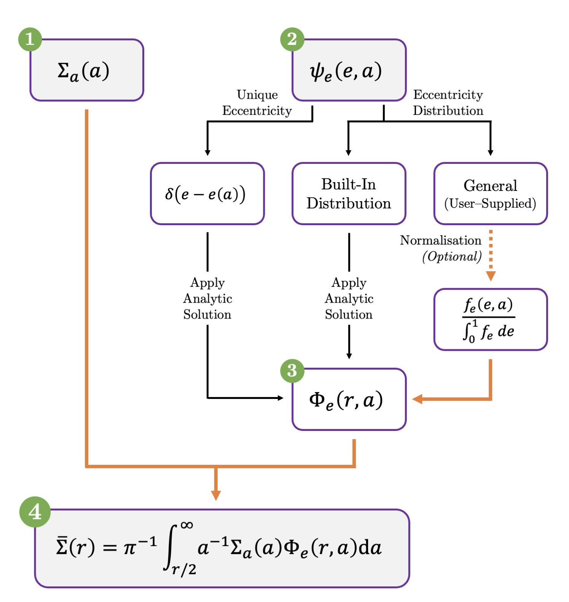

Package Design
==============

This section outlines the modular structure of `DebrisPy`, illustrating how different components interconnect.

ASD Pipeline and Data Flow
--------------------------

The diagram below summarises the data flow and functional organisation of `DebrisPy`. Each numbered step corresponds to a core component in the pipeline:

1. **Surface Density Profile** — :math:`\Sigma_a(a)`  
   The pipeline begins with the user-supplied semi-major axis surface density profile. This may follow one of the built-in profiles or any custom function (see :ref:`sigma_a`).

2. **Eccentricity Profile** — :math:`\psi_e(e, a)`  
   The user then specifies the eccentricity behaviour:
   
   - *Unique Eccentricity*: A deterministic mapping :math:`e = e(a)` (see :ref:`unique_ecc`)
   - *Built-In Distributions*: Predefined models such as Rayleigh distribution (see :ref:`builtin_ecc_distribution`)
   - *General User-Supplied*: Arbitrary functions :math:`f_e(e, a)`, which can be automatically normalised (see :ref:`custom_ecc_distribution`)

3. **Kernel Calculation** — :math:`\Phi_e(r, a)`  
   For each eccentricity model, an appropriate analytic or semi-analytic (via numerical integration) method computes the kernel :math:`\Phi_e(r, a)`, this can be thought of as the probability that a particle with semi-major axis :math:`a` appears at radius :math:`r` (see :ref:`kernel`).

4. **ASD Integration** — :math:`\bar{\Sigma}(r)`  
   Finally, the package computes the azimuthally averaged surface density (ASD) by performing the integral (see :ref:`asd`):

   .. math::
      \bar{\Sigma}(r) = \pi^{-1} \int_{r/2}^{\infty} a^{-1} \Sigma_a(a) \Phi_e(r, a) \, da

Each stage is defined by its own module, with consistent interfaces and room for extension. This modular design allows each component to be independently tested, validated, or replaced — ensuring flexibility and robustness across a range of debris disc scenarios.

In addition to the main pipeline, `DebrisPy` includes a Monte Carlo sampler to compare with the semi-analytic ASD predictions (see :ref:`monte_carlo`).

Thanks to its object-oriented, class-based architecture, `DebrisPy` allows users to construct a clean and efficient pipeline in just a few lines of code. Intermediate results (such as the kernel distributions) are automatically cached, minimising redundant computation and keeping user code uncluttered. Nonetheless, full access to intermediate quantities is available when needed, ensuring both usability and transparency.

Dependencies
------------

`DebrisPy` requires **Python 3.8 or higher**, and is designed to run efficiently with a lightweight but powerful collection of scientific Python packages. All required dependencies are installed automatically via `pip`.

The package uses the following core libraries:

**Numerical and Scientific Computing**

- `numpy`: fast array manipulation and vectorised math
- `scipy`: numerical integration, special functions, and interpolation
- `fast_histogram`: high-performance 1D/2D histogramming
- `adaptive`: optional grid refinement and adaptive sampling
- `matplotlib`: 1D and 2D surface density plotting
- `tqdm`: progress bars for long-running sampling routines

**Parallelism and Utilities**

- `joblib`: parallel execution for kernel computations
- `functools`, `itertools`: functional programming utilities
- `typing`: static type annotations for clarity and linting
- `warnings`: controlled user warnings for numerical operations